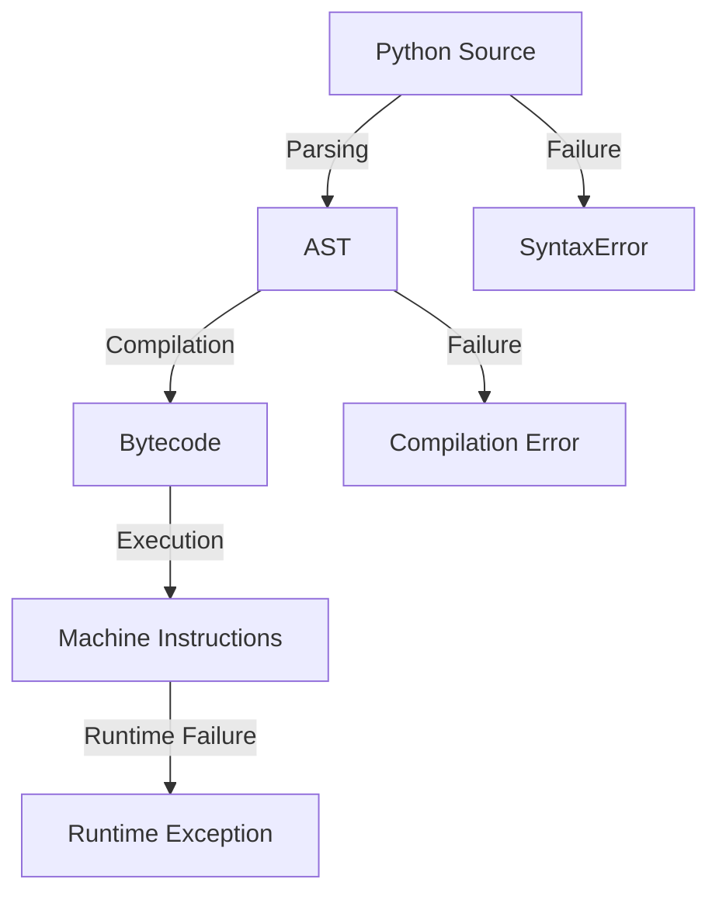

# Python Introduction
TAGS: #Python 
BUILT-ON: - 
ENABLES: - 
PREREQUSITIES: -

---
## Python Introduction
Python is a high-level[^1], general-purpose[^2] & multi-paradigm[^3] programming language that can be used to build software ranging from small scripts to large systems.

**Python** refers to the programming language: its syntax, semantics, rules, and behaviour.
A **Python implementation** is software that implements that language. The most important implementation you will encounter is CPython (Other implementations: PyPy, Jython). 

#### Python Characteristics
| Characteristic    | Explanation                                                                                                           |
| ----------------- | --------------------------------------------------------------------------------------------------------------------- |
| High-level        | Provides abstraction over machine-level details                                                                       |
| General-purpose   | Suitable for many classes of applications                                                                             |
| Dynamically typed | Types are associated with objects at runtime rather than requiring every variable declaration to specify a fixed type |
| Multi-paradigm    | Supports procedural, object-oriented, functional, and other programming styles                                        |
| Interpreted*      | Uses interpreter which is the implementation/runtime that gives the language its behavior.                            |
| Garbage-collected | Python implementations automatically manage much of object memory management                                          |
#### Python Location
Python sits above the operating system and hardware and provides abstractions that allow us to express computation at a much higher level. Python and its runtime, together with the operating system, handle those lower-level details.
```
┌──────────────────────────────┐
│        Application           │
├──────────────────────────────┤
│      Programming Language    │
│           Python             │
├──────────────────────────────┤
│       Python Runtime         │
├──────────────────────────────┤
│      Operating System        │
├──────────────────────────────┤
│          Hardware            │
└──────────────────────────────┘
```

#### Python as Programming Language
Python provides rules for:
- **Syntax**: describes the structural rules of valid Python code.
- **Semantics**: concerns the meaning or behaviour of valid code.
- **Execution**: how a Python implementation carries out that meaning

## Python's Execution
Python Source Code is not machine/CPU executable. It needs to be converted into CPU executable set of machine code/instructions. 
This is performed in the following steps.
#### Parsing
- Parsing is the process of determining whether the source code conforms to Python's grammatical structure. 
- Parsing of Source code results in AST (Abstract Syntax Tree)[^5]
- Syntax/Parse Errors are caught when parsing fails.

#### Compilation
- Compilation is the process of conversion of source code into an intermediate representation known as Bytecode [^4]
- The intermediate bytecode/runtime layer mainly solves portability and complexity. 
- Direct native compilation: potentially faster and standalone, but much more target specific compiler/runtime work.
- Bytecode + runtime: more portable and flexible, with some runtime overhead.
>**NOTE**:
>	In Python, There is no particular error/failure category like `CompileTime Error` and hence failures during compilation pipeline are categorised as `SyntaxError`.
>	
>	**Python bytecode itself isn't a universal portable binary format.** CPython's documentation explicitly says bytecode isn't expected to work across different Python VMs or remain stable across Python releases.

#### Execution
- Python Virtual Machine (PVM) is a component in CPython that reads bytecode instructions and performs the operations described by that  bytecode instruction. The PVM/CPython runtime does **not necessarily translate each bytecode instruction into a corresponding sequence of native machine instructions** in the way a traditional compiler translates source code into machine code.
- Instead, conceptually, the CPython runtime **interprets/dispatches the bytecode instructions and performs the operations they describe** using CPython's runtime machinery. 
- The PVM/CPython runtime executes Python bytecode and provides the machinery required to implement Python's runtime semantics. The CPU ultimately executes platform-dependent native instructions belonging to the runtime, rather than Python bytecode directly.



## Bytecode Caching 
- `__pycache__` folders containing `.pyc` files are generated for module files during the first import into the `flow/main` file when the main file is ran. These `.pyc` files contain bytecode of the respective module file caches for reusing instead of compiling the module files over and over again.
- The `.pyc` still contains Python bytecode, which requires an appropriate Python runtime to execute.
- For `.pyc` invalidation, CPython supports different strategies. In particular, cached bytecode can be validated using **source metadata such as modification time and size**, or using a **hash-based** invalidation mode. So the general principle is:
	  CPython must determine whether the cached bytecode is still valid for the current source before reusing it. 

## Python Versioning
A Python version identifies a particular release of the Python language and its implementation. 
Modern Python versions use `MAJOR.MINOR.PATCH` 
- Major Version: Represents the major generation of Language
- Minor Version: Adds language and standard-library functionality with a major version
- Patch Version: Primarily contains bug fixes and security fixes without intentionally introducing major language changes.
Different versions can have different:
- Language features
- Standard-library features
- Bug fixes
- Performance characteristics
- Compatibility requirements
A project usually specifies a **supported Python version range**, because compatibility can depend on both language and library versions.

#### PYTHON VERSIONS COEXISTANCE
Projects can have different:
- Dependency requirements
- Supported Python versions
- Legacy constraints
- Testing requirements
~={purple}Python installation=~: The actual Python interpreter installed on your operating system.
~={purple}Virtual environment=~: An isolated environment created for a particular project, containing its own project-specific packages and associated Python interpreter/environment configuration (From the installed set of Python versions, say a virtual environment can be created for the project with its project-specific packages and python interpreter/env Python 3.11 only if Python 3.11 is also installed on the computer.

#### PYTHON RESOLUTION
- When a command `python --version` is executed in a terminal. The system does not internally know what Python is. The shell/operating system resolves `python` using its command-resolution rules, which commonly involve `PATH` -  a set of Directories and return the first executable named python it finds. 
- The exact mechanism of Python resolution varies by OS and shell.

#### PYTHON ENVIRONMENT
A virtual environment is an isolated Python environment associated with a particular Python interpreter, with its own environment-specific packages and executable setup. Activation does not create the environment. It changes which **environment's tools your shell resolves by default**.
~={purple}CREATION=~: `python -m env <ENVIRONMENT_NAME>`
~={purple}ACTIVATION=~: 
- Windows: `source ENVIRONMENT_NAME/Scripts/activate` 
- Linux: `source ENVIRONMENT_NAME/bin/activate`
~={purple}DEACTIVATION=~: `deactivate`
~={purple}DELETION=~:
- Delete the ENVIRONMENT_NAME Folder 
- Windows:`rmdir /s /q ENVIRONMENT_NAME`
- Linux/MacOS: `rm -rf ENVIRONMENT_NAME`
>~={purple}NOTE=~:
>If a project is needed to use a specific version of Python we install that version of Python on the system and create a virtual environment and select the desired python interpreter/environment this overrides the PATH lookup by placing the environment's Python executable earlier in command resolution, so python resolves to the environment's interpreter rather than the system/default one.
>
>Python and Python3 commands may not point to the same python executable because `python` and `python3` are **commands whose resolution depends on the system configuration**. 
>This is because historically python3 command was introduced to distinguish from python which was pointing python generation 2 on older computers. So historically these commands coexisted and can point to different python executables. In a broader sense today in most of the systems python and python3 point to the same python3 interpreter (not necessarily the same executable version)

#### Python Terminal Commands 
Below are few Python Terminal commands worth checking out:
- `python --version`: Tells us the version of Python executable in use.
- `where python`: Tells us the interpreter location of the Python executable in use (Particularly useful when multiple environments co-exist on a machine)
- `python source_code_path` Executes the source code file. 
- `python -m package.module` helps execute the module code instead of using `python package/module.py`. `-m` gives you a way to execute the file as a module. This way \_\_name\_\_  gives main instead of module name.
- `python -c "<CODE WRAPPED IN STRINGS>"` executes the python code directly.

## Code Organisation/Run
The different ways in which we can organise/run code are as below:
#### REPL
- Read Evaluate Print Loop (REPL) is an interactive python environment where entered python expressions are immediately evaluated and their result printed/displayed.
- Primarily used for:
	- Experimenting with Python
	- Testing small pieces of code 
	- Inspecting Behaviour
#### Script
- A python source file containing of python code that is executed directly.
- A script describes how a Python file is used. 
#### Module
- A python source file consisting of python code serves as a module when another python program imports it.
- A Module describes its role as an importable unit.
- When a module is imported it loads the module content, executes the top level code and binds it to the name `module_name` or `alias_name` when alias is used. 
#### Packages
- A package organizes related modules into a larger importable structure.
- A package is a collection of logically similar modules designed to complete a particular task.

#### Editors, IDE & Terminals
 - ~={purple}EDITORS=~: A text editor primarily helps you write and modify source code.
 - ~={purple}IDE=~: An **IDE** combines several development tools into one environment.
	 Typical IDE capabilities include:
	 - Code editing
	- Autocomplete / IntelliSense
	- Project navigation
	- Running programs
	- Debugging
	- Testing
	- Git integration
	- Refactoring
	- Error inspection
- ~={purple}TERMINAL=~: The **terminal** is an interface through which you interact with the operating system using commands.

## Debugging
Debugging is the systematic process of finding, understanding, and fixing defects in a program.
Some of the tools used for debugging are as below:
#### Stack Trace
- When Python encounters an unhandled runtime exception, it produces a **traceback** (often called a stack trace).
- It is known as a traceback as Python is showing the chain of active function calls that led to the failure. This chain of active functions is called the **call stack**.
#### Breakpoint
- A breakpoint allows you to **pause the program and inspect its execution state interactively**.
- Once execution is paused at a breakpoint, you generally control execution using **stepping operations**. The exact button names can vary between IDEs, but the concepts are consistent.
	- ~={purple}Step Over=~: Execute the current line and move to the next line without entering a called function.
	- ~={purple}Step Into=~: Execute the current line and enter a function being called.
	- ~={purple}Step Out=~: **Step Out** finishes the current function and returns to its caller.

### PRACTICAL DEBUGGING WORKFLOW
- STEP 1: Reproduce the problem 
- STEP 2: Extinguish Expected vs Actual Behaviour
- STEP 3: Classify the Error (Syntax/Runtime/Logical)
- STEP 4: Read the error message/traceback
- STEP 5: Form a hypothesis
- STEP 6: Set a Strategic Breakpoint before the suspected failure
- STEP 7: Use stepping and observe values changing
- STEP 8: Identify root cause
- STEP 9: Make smallest fix
- STEP 10: Rerun original testcase
- STEP 11: Test related cases

### DEBUGGER
A debugger gives you tools to observe execution:
- breakpoints
- variables
- call stack
- stepping
- watches
- exception information


# END
---
#### FOOTNOTES

[^1]: A **high-level language** abstracts away many details of the underlying machine without explicitly managing:
	- memory addresses
	- CPU registers
	- machine instructions
	- memory allocation details

[^2]: Python is not designed for one specific category of problems.
	It can be used for:
	- automation
	- web development
	- backend systems
	- data processing
	- scientific computing
	- machine learning
	- testing
	- scripting
	- command-line tools
	- system administration
	- application development

[^3]: Supports procedural, object-oriented, functional, and other programming styles

[^4]: Bytecode:
	Bytecode is platform-independent code meaning that it is portable and can be run on a different system.  Bytecode is platform-independent as it is not dependent on the CPU architecture and the hardware of the machine.
	
	Bytecode is however version-dependent i.e. It depends on the version of the Python implementation on the system. 
	CPython uses bytecode as an intermediate representation between Python source code and native machine instructions. This separates Python’s language semantics from the underlying CPU architecture, allowing the same Python program to be executed by CPython implementations targeting different platforms.

[^5]: An Abstract Syntax Tree (AST) is a structural representation of the source code. It is used to represent the structure and relations in the Source code.
